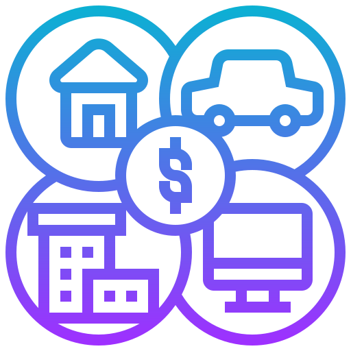

<br/>
<p align="center">
  <a href="https://github.com/AvinashMahala/PropertyDataManagementSystem">
    
  </a>

  <h3 align="center">Property Data Management System (PDMS)</h3>

  <p align="center">
    Effortlessly Manage Property Data with PDMS: Your Complete Solution for Property Management!
    <br/>
    <br/>
    <a href="https://github.com/AvinashMahala/PropertyDataManagementSystem"><strong>Explore the docs »</strong></a>
    <br/>
    <br/>
    <a href="https://github.com/AvinashMahala/PropertyDataManagementSystem">View Demo</a>
    .
    <a href="https://github.com/AvinashMahala/PropertyDataManagementSystem/issues">Report Bug</a>
    .
    <a href="https://github.com/AvinashMahala/PropertyDataManagementSystem/issues">Request Feature</a>
  </p>
</p>

      

## Table Of Contents

- [Table Of Contents](#table-of-contents)
- [About The Project](#about-the-project)
- [Built With](#built-with)
- [Getting Started](#getting-started)
  - [Prerequisites](#prerequisites)
  - [Installation](#installation)
- [Usage](#usage)
- [Roadmap](#roadmap)
- [Contributing](#contributing)
  - [Creating A Pull Request](#creating-a-pull-request)
- [License](#license)
- [Authors](#authors)
- [Acknowledgements](#acknowledgements)

## About The Project


PDMS (Property Data Management System) is a comprehensive software solution designed to streamline and simplify property management tasks. Whether you're a real estate agency, property owner, or property manager, PDMS offers a user-friendly interface and powerful features to efficiently manage property data, tenants, maintenance requests, and more.

Key Features:

* Property Management: Easily track and manage property details, including ownership information, rental agreements, and unit details.
* Tenant Management: Maintain tenant records, lease agreements, payment history, and communication logs in one centralized platform.
* Maintenance Tracking: Effectively manage maintenance requests, track their status, assign tasks to maintenance staff, and generate work orders.
* Analytics and Reporting: Gain valuable insights into property performance, occupancy rates, rental income, and other key metrics through comprehensive analytics and reporting tools.
* User Authentication and Access Control: Ensure data security with user authentication and role-based access control to restrict access to sensitive information.

## Built With

PDMS is built using the MERN (MongoDB, Express.js, React, Node.js) stack, leveraging the power and flexibility of these technologies to deliver a robust and scalable property management solution.

* [MongoDb](https://www.mongodb.com/docs/manual/)
* [React](https://react.dev/learn)

## Getting Started

To set up PDMS locally, follow the instructions provided in the Installation section of the README file. The documentation also includes detailed guides on configuring the application and utilizing its various features.

### Prerequisites

Before getting started with PDMS, ensure that you have the following prerequisites in place:

Node.js and npm: PDMS is built on the MERN (MongoDB, Express.js, React, Node.js) stack, so you need to have Node.js and npm (Node Package Manager) installed on your machine. You can download and install them from the official Node.js website: https://nodejs.org.

MongoDB: PDMS utilizes MongoDB as the database system. You must have MongoDB installed and running locally or have access to a remote MongoDB instance. Visit the MongoDB website for installation instructions: https://www.mongodb.com.

Git: PDMS is typically managed using Git for version control. Make sure you have Git installed on your machine. You can download Git from https://git-scm.com.

Text Editor or IDE: You'll need a text editor or an integrated development environment (IDE) to work with the project source code. Choose an editor or IDE of your preference, such as Visual Studio Code, Sublime Text, or Atom.

### Installation

To install and set up PDMS on your local machine, follow these steps:

1. Get a free API Key at [https://example.com](https://example.com)

2. Clone the repository using Git:

     ```sh
     git clone https://github.com/AvinashMahala/PropertyDataManagementSystem.git
      ```

3. Install backend dependencies:

     ```sh
     cd pdms/backend
     npm install

     ```

4. Install frontend dependencies:

     ```sh
     cd ../frontend
     npm install
     ```

## Usage

1. User Registration:
   - Navigate to the registration page and provide the required information.
   - Click the "Register" button to create a new user account.

2. Dashboard:
   - Upon successful login, you will be directed to the dashboard.
   - View key information and statistics on the dashboard.

3. Property Management:
   - Click on the "Properties" section to manage properties.
   - Add a new property by clicking the "Add Property" button and providing the necessary details.
   - Edit or delete existing properties from the property list.

4. Tenant Management:
   - Access the "Tenants" section to manage tenant records.
   - Add new tenants by clicking the "Add Tenant" button and providing their details.
   - Edit or remove tenant records as needed.

5. Maintenance Tracking:
   - Track maintenance requests in the "Maintenance" section.
   - View a list of open requests, assign them to maintenance staff, and monitor progress.
   - Add new maintenance requests and update their status.

6. Analytics and Reporting:
   - Explore the "Analytics" section to generate reports on property performance.
   - Use these reports to gain insights into occupancy rates, rental income, and maintenance performance.

7. Account Settings:
   - Customize your account settings by accessing the "Account Settings" section.
   - Update your profile information, change your password, and manage notification preferences.

8. Log Out:
   - Click the "Log Out" button in the navigation menu to log out of the application.

Please note that the above instructions provide a general outline of the usage flow. You may need to adapt and expand upon these instructions based on the specific features and functionalities of your PDMS application.


## Roadmap

See the [open issues](https://github.com/AvinashMahala/PropertyDataManagementSystem/issues) for a list of proposed features (and known issues).

## Contributing

Contributions are what make the open source community such an amazing place to be learn, inspire, and create. Any contributions you make are **greatly appreciated**.
* If you have suggestions for adding or removing projects, feel free to [open an issue](https://github.com/AvinashMahala/PropertyDataManagementSystem/issues/new) to discuss it, or directly create a pull request after you edit the *README.md* file with necessary changes.
* Please make sure you check your spelling and grammar.
* Create individual PR for each suggestion.
* Please also read through the [Code Of Conduct](https://github.com/AvinashMahala/PropertyDataManagementSystem/blob/master/CODE_OF_CONDUCT.md) before posting your first idea as well.

### Creating A Pull Request

1. Fork the Project
2. Create your Feature Branch (`git checkout -b feature/AmazingFeature`)
3. Commit your Changes (`git commit -m 'Add some AmazingFeature'`)
4. Push to the Branch (`git push origin feature/AmazingFeature`)
5. Open a Pull Request

## License

Distributed under the MIT License. See [LICENSE](https://github.com/AvinashMahala/PropertyDataManagementSystem/blob/master/LICENSE.md) for more information.

## Authors

* **Avinash Mahala** - *Computer Science Student* - [Avinash Mahala](https://github.com/AvinashMahala) - *PDMS Project*
* **Debashish Kar** - *Computer Science Student* - [Debashish Kar](https://github.com/kardebkar) - *PDMS Project*

## Acknowledgements

* [Image Shields](https://shields.io/)
* [Logo](<a href="https://www.flaticon.com/free-icons/fixed-asset" title="fixed asset icons">Fixed asset icons created by Eucalyp - Flaticon</a>)
